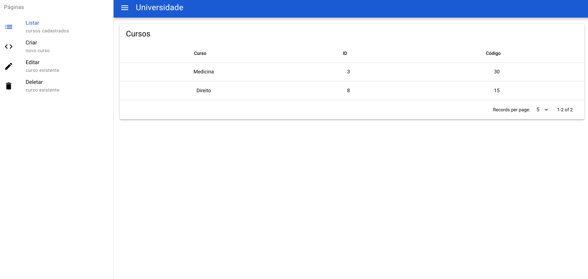
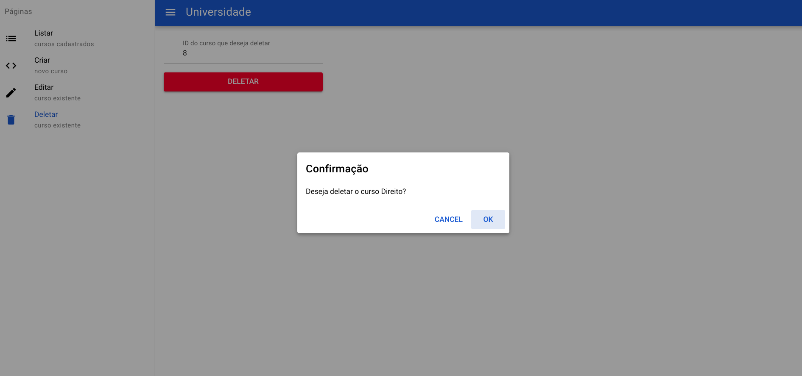

# Universuty Quasar-project

This is a simple university system to register and administer courses. The front-end is made with Vue and Quasar and for the backend i used Json Server (just for tests)
 

> List page

 

> Create page

 

> Edit page

 

> Delete page

